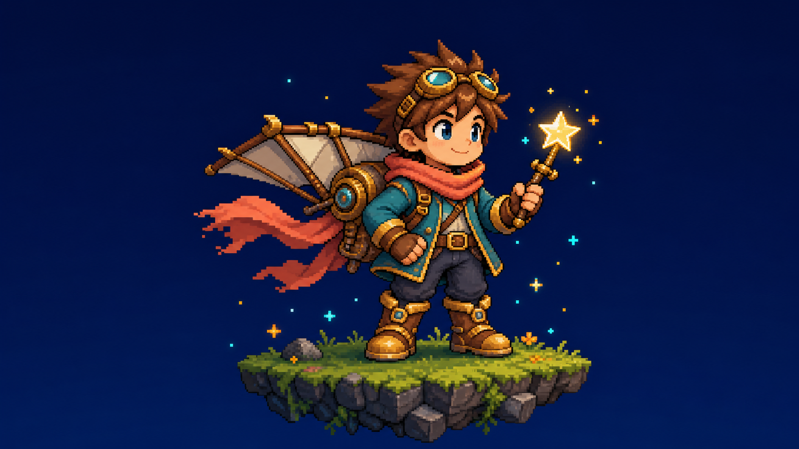

# SpriteForge Studio

SpriteForge Studio is a local-first workshop for turning an idea, existing
art, or a short video into game-ready 2D character assets. It combines guided
creation, frame cleanup, review, playtesting, and engine-focused export in one
browser workspace.



## What it is for

- Create an original character from a short description or reference image.
- Convert an existing video into a packed sprite sheet.
- Inspect motion, repair common frame issues, and playtest a character before
  export.
- Build standalone pixel assets, tilesets, animations, and cohesive starter
  packs in Pixel Studio's **Cohesive Pack Builder**.
- Export a clean package for Godot, Unity, Unreal, web formats, or plain PNG
  assets.

The default experience is intentionally simple: it presents the next useful
choice first, keeps advanced controls available when needed, and never requires
an AI model download just to explore the included demo.

## Quick start

### Windows

From the repository or packaged application root, run:

```bat
START_HERE.bat
```

### Other platforms

Run the local launcher supplied with your checkout, for example:

```bash
./start.sh
```

Then open the local browser address printed by the launcher.

## Your first character

1. Open **Home** and choose **Start creating**.
2. Pick a goal: make one character, build a pack, convert a video, or prepare
   a release.
3. Give the character a name and a short description. The wizard starts with
   friendly defaults so you can learn the flow without prompt engineering.
4. Choose a few first moves and a direction. More advanced controls are still
   available through **Customize**.
5. Review the ready check. SpriteForge can start its local creation engine when
   needed; disk space and an active job remain clear blockers.
6. Use **Review** to inspect and polish the result, then choose **Export** to
   pack it for your target.

Want to explore before setup? Choose **Try a demo** on Home. It always loads
the bundled demo character in the Play Workbench.

## Main areas

| Area | Use it for |
| --- | --- |
| Home | Start a character, continue recent work, or launch the bundled demo. |
| Projects | Switch projects and revisit recent creations. |
| Create | Guided character creation with advanced controls available on demand. |
| Studio | Fine-tune animation and frame details. |
| Review | Run friendly quality checks, repair common issues, and playtest. |
| Export | Package a reviewed character for a game engine or image workflow. |
| Pixel Studio | Make pixel characters, items, tilesets, animations, and packs. |
| Settings | Check local setup, providers, preferences, and the optional Forge guide. |

Keyboard arrows move within the colorful menu surfaces; **Enter** chooses the
focused action. Controller navigation is optional in **Settings → Playful
workshop**. Motion and interface effects respect reduced-motion preferences.

## Local setup and optional generation

The bundled demo, review tools, and most project flows work without a GPU.
Text-to-video generation is optional and uses a local ComfyUI/WAN setup when
configured. In **Settings**, SpriteForge shows what is ready and what still
needs attention. Start with the no-GPU demo before downloading large model
weights.

Cloud-provider keys, if you use them, are stored locally. The Forge companion
uses approved local documentation and can only suggest safe navigation; it does
not run commands or change project data.

## Output packages

A typical character output includes:

```text
my_character/
├── sheet.png              # packed sprite sheet
├── sheet.json             # frame, timing, and pivot metadata
├── preview.gif            # animation preview
├── report.html            # quality/report overview
├── frames_processed/      # individual processed frames
└── engine exports/        # target-specific helpers when requested
```

Use **Export** or **Release** to produce a fresh shareable package. Do not add
model weights, local uploads, logs, or generated release folders to source
control.

## Documentation

- [End-user guide](app/docs/END_USER_GUIDE.md) — detailed day-to-day workflows.
- [First-run checklist](app/docs/FIRST_RUN_CHECKLIST_v8.md) — setup and a safe
  first test.
- [One-page cheat sheet](app/docs/ONE_PAGE_CHEAT_SHEET.md) — quick reference.
- [Troubleshooting](app/docs/TROUBLESHOOTING_v8.md) — setup, model, and output
  fixes.
- [Forge guide](app/docs/LOCAL_FORGE_GUIDE.md) — local companion behavior and
  privacy boundaries.
- [API reference](app/docs/api.md) — API-facing integration details.
- [Packaging and recovery](docs/PACKAGING_AND_RECOVERY.md) — release and
  support-bundle guidance.

Files with versioned or roadmap names document earlier milestones and planning
context; the guides above describe the current user-facing workflow.

## Development

Run the automated suite from the repository root:

```bash
python -m pytest -q
```

The current product-polish suite contains 649 tests, including browser
acceptance checks for the consumer workflow and production tools.

## License and notices

See [LICENSE](LICENSE) and [THIRD_PARTY_NOTICES.md](THIRD_PARTY_NOTICES.md).
Third-party source payloads and local model files have their own license and
distribution requirements.
